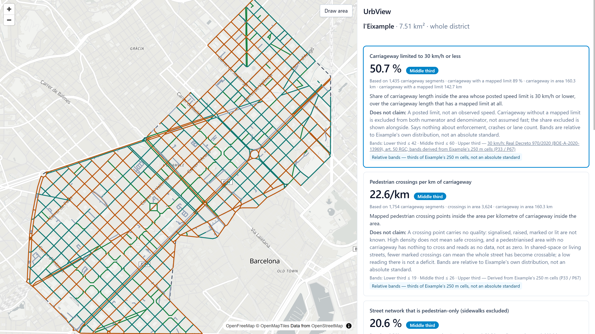
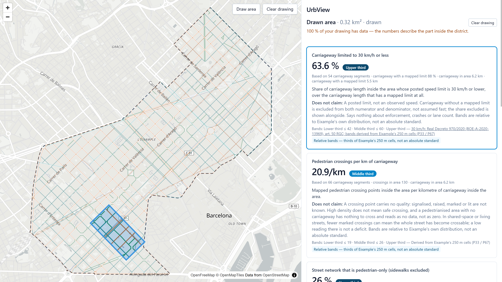
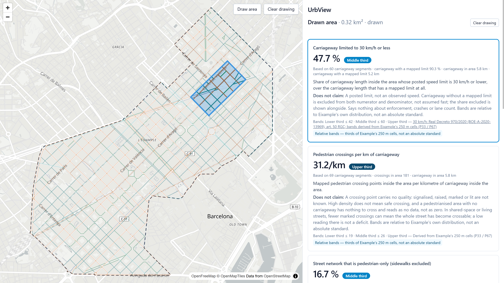
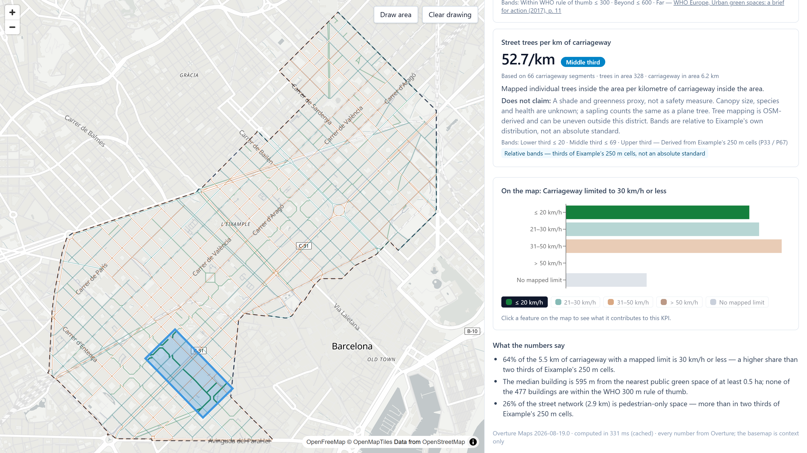
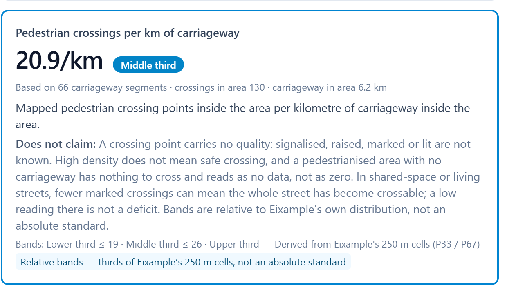

# Reading a district from open map data

## Eixample, Barcelona · 7.51 km² · Overture Maps `2026-08-19.0`

<div class="cols cols--wide-left">
<div>

**What can a planner honestly read from Overture alone — and what can they not?**

Overture is the **only** source: no OSM top-up, no municipal open data, no GTFS. Where
Overture is thin, that is a **finding**, not a hole to patch.

No socioeconomic data anywhere — not as a KPI, not as a denominator. Denominators are
street length, segment count or building count.

Five KPIs: a **share**, two **densities**, a **distance**, and a second share. Draw any
polygon; every number recomputes for that polygon alone.

</div>
<div>

### Why Eixample

7.51 km², a grid dense enough that a drawn block still has real sample sizes, and a place
with a **known intervention** to test against: the Sant Antoni superblock.

</div>
</div>

---

# The district read

<div class="figures">
<div class="figure"><span class="value">50.7 %</span><span class="label">carriageway limited to 30 km/h (89 % has a mapped limit)</span></div>
<div class="figure"><span class="value">22.6</span><span class="label">crossings per km of carriageway</span></div>
<div class="figure"><span class="value">20.6 %</span><span class="label">street network that is pedestrian-only</span></div>
<div class="figure"><span class="value">362 m</span><span class="label">median distance to a public green ≥ 0.5 ha</span></div>
<div class="figure"><span class="value">55.4</span><span class="label">street trees per km of carriageway</span></div>
</div>

**Only 41 % of Eixample's 8,397 buildings are within 300 m of a public green space of at
least 0.5 ha.** The WHO rule of thumb says they should be.



<span class="small">The district reads "Middle third" on the four relative bands by construction — it *is* the distribution they were cut from.</span>

---

# Two areas, same size

<div class="cols cols--wide-right">
<div>

**A — Sant Antoni superblock**
Comte Borrell, Tamarit → Consell de Cent
0.318 km²

**B — Aragó corridor**
Same length and width, east of the axis
0.317 km²

| | A | B |
|---|---|---|
| ≤ 30 km/h | **63.6 %** | 47.7 % |
| Crossings / km | 20.9 | **31.2** |
| Pedestrian-only | **26.0 %** | 16.7 % |
| Green p50 | 595 m | **151 m** |
| Trees / km | 52.7 | 50.3 |

</div>
<div>




</div>
</div>

**The intervention is in the data:** Comte Borrell and Consell de Cent are `living_street` at 10 km/h.

---

# One state, read both ways

## A dashboard category highlights the map; a map feature explains its contribution

<div class="cols">
<div>



**Dashboard → map.** Clicking the *≤ 30 km/h* bar emphasises those streets and dims the rest
— no refetch, the layer is already loaded.

<span class="small"><code>toggleCategory</code> → <code>emphasisExpression</code> → <code>setPaintProperty</code></span>

</div>
<div>


**Map → dashboard.** Clicking a street names it and says what it contributes to the active
KPI, from the loaded layer.

<span class="small"><code>selectFeature</code> → <code>describeContribution</code> — one pure rule per KPI</span>

</div>
</div>

<span class="small">Map and dashboard never import each other: they meet in one store that holds selection only.</span>

---

# What the numbers do not claim

## The same comparison, read honestly

<div class="cols">
<div>

### A "loses" two of five

**Crossings — the meaning inverts.** Shared space at 10 km/h is crossable along its whole
length, so marked crossings are removed. This KPI **falls** where a planner succeeded.

**Green — structurally blind.** The Consell de Cent axis is *linear* greening; a
"≥ 0.5 ha polygon within 300 m" rule cannot see it. B's 151 m is Sagrada Família's gardens.

</div>
<div>

### So there is no composite score

Every card carries its own **does not claim** line, next to the number — not buried in a
document.

<span class="note">Adding the five into one index would destroy exactly the caveats that make
them usable.</span>



</div>
</div>

---

# Where every threshold comes from

| | Threshold | Source |
|---|---|---|
| **Cited** | 30 km/h urban limit | RD 970/2020, art. 50.1 RGC: *"30 km/h en vías de un único carril por sentido"* |
| **Cited** | 300 m, 0.5 ha | WHO Europe 2017, p. 11: *"public green spaces of at least 0.5–1 hectare within 300 metres"* |
| **Derived** | 42/60, 19/26, 14/24, 20/69 | P33 / P67 across Eixample's 250 m cells |
| **Chosen** | 600 m green band | Double the WHO distance |
| **Chosen** | 0.5 km cell minimum | One segment would decide a cell's value |
| **Chosen** | 75 % coverage warning | "A clear majority" — changes no value, only a warning |

Derived bands are labelled **Lower / Middle / Upper third** and marked *relative to
Eixample* on the card. Any evaluative word on a percentile cut would overclaim.

<span class="small">Both citations were opened and quoted from the source text, not from memory. `make derive-bands` regenerates the tertiles.</span>

---

# Three times, the data measured the mappers

<div class="cols">
<div>

**Street lamps — rejected.** 236 in 7.5 km², 65 % of them in two 1-km cells; one full cell
with 58.9 km of road has none. The KPI would have scored survey effort and called it
"dark streets".

**Land-use mix — rejected.** Land use covers 29.7 % of the district, 61 % of that one
class. An entropy over it measures coverage.

</div>
<div>

**Pedestrian share — caught in build.** v1 read 52 % district-wide and 49.9–55.2 % across
cells: suspiciously flat. Sidewalk km per carriageway km ranged 0.68–1.54 (median 1.09)
where a fully mapped grid gives ~2. **The variance was OSM sidewalk coverage.** Excluding
sidewalks: **20.6 %**, spanning 0–71 % across cells, and it now measures something a
planner can change.

<span class="note">Transit was rejected for the opposite reason: clean data, no variance — 100 % of buildings within 300 m of a stop.</span>

</div>
</div>

---

# Architecture

```
Overture S3 (GeoParquet)
   │  extract.py — bbox pushdown, 6 themes, 6.8 MB          make extract
   ▼
data/raw/*.parquet
   │  build.py — clip to district, ST_Transform → EPSG:25831, RTREE per table
   ▼
data/warehouse.duckdb ──────────┐ one connection per process, one cursor per request
                                │ area registered once: drawn ∩ district
PostgreSQL (districts,          │
  editable KPI metadata) ───────┤
                                ▼
                    Django + DRF  POST /api/v1/kpis
                                │  OpenAPI → openapi-typescript → schema.gen.ts
                                ▼
                     React — one Zustand store (selection only)
                       ├── MapLibre + terra-draw
                       └── Dashboard (cards, chart, legend)
```

Numbers live **once**, in TanStack Query keyed by the area. The store holds selection.

---

<!-- _class: dense -->

# Decisions, and what they beat

| Chosen | Rejected | Why |
|---|---|---|
| **DuckDB + GeoParquet** | PostGIS | The extraction path *is* GeoParquet: one engine end to end, no load step |
| **REST + OpenAPI** | GraphQL | Generated client types for a fraction of the setup |
| **Postgres for metadata only** | All of it, or none | Bands and citations become rows a planner can audit |
| **Prepared extract, public data repo** | Commit it, or hit S3 | Script committed, data not; running in 15 minutes |
| **OpenFreeMap basemap** | No basemap | Cartographic context only; no KPI reads it |

<div class="cols cols--wide-left">
<div>

```sql
WITH clipped AS (              -- area = drawn ∩ district
  SELECT max_speed_kmh,
         CASE WHEN ST_CoveredBy(geom_m, area_m())
              THEN length_m                -- wholly inside
              ELSE ST_Length(
                ST_Intersection(geom_m, area_m()))
         END AS len_m
  FROM segments
  WHERE is_carriageway
    AND ST_Intersects(geom_m, area_m())
)
SELECT 100.0 * sum(len_m) FILTER (WHERE max_speed_kmh <= 30)
     / nullif(sum(len_m) FILTER (WHERE max_speed_kmh IS NOT NULL), 0)
FROM clipped;        -- …breakdown and context omitted
```

</div>
<div>

| Area binding | Plan | District |
|---|---|---|
| Temp-table join | SPATIAL_JOIN | 13.5 ms |
| Inlined WKT | RTREE | 4.6 ms |
| Prepared `?` | RTREE | 5.6 ms |
| **Macro over `SET VARIABLE`** | RTREE | **3.6 ms** |

Measured with `EXPLAIN`: DuckDB uses the R-tree only when the predicate argument is
**constant at plan time** — hence a macro over a session variable, registered **once per
request**.

</div>
</div>

**No Python loop over features** — and the denominator is visible in the query.

---

# Four bugs that taught something

**Axis order.** `ST_Transform` to EPSG:25831 put Barcelona 4 700 km away — EPSG:4326 is
officially (lat, lon) and DuckDB honours it. → `always_xy := true` on every transform, and a
repo rule so it cannot come back.

**Drawn ∩ district.** A box drawn *around* the district read 51.3 %, the district 50.7 %.
Segments touching the district are stored whole, so clipping to the raw drawing counted
their outside halves. → clip once in the resolver; pinned by a test that draws a containing box.

**`list()` ignores a CTE's `ORDER BY`.** Chart bars reordered between identical requests when
two classes tied. → sort inside the aggregate.

**DuckDB caches instances per path.** After `make load-data`, reopening returned the *old*
file silently. → drain cursors, close, then reopen.

---

# What breaks at 10×

<div class="cols">
<div>

**Payload.** The district ships 6.0 MB of GeoJSON (1.1 MB gzipped). At 10× districts or 10×
zoom, that becomes vector tiles: static geometry served once, per-request ids and values
joined with `feature-state`.

**Computation.** Clipping per request is right at 7.5 km². At city scale, precompute each KPI
on an H3 grid and aggregate cells for large polygons, clipping only the boundary ring.

**Storage.** One DuckDB file → Parquet partitioned by district and theme, with the file the
query engine reads chosen by the area.

</div>
<div>

**Cache.** Honest limit: drawn polygons essentially never repeat, so the cache serves the
district and repeats. Redis moves it off-process; the real win is the H3 precompute above.

**Concurrency.** `runserver` → gunicorn workers, each with its own read-only connection and
its own cursor per request. The connection layer is already shaped for that.

**Latency.** Past ~2 s a synchronous request is wrong: job queue, return KPI values first,
stream layers after. Today the district is 2.1 s cold, 0.4 s cached; a block is 0.35 s.

</div>
</div>

---

# Another week

<div class="cols">
<div>

### I would add

**Compare two areas side by side** — the A/B table is the most useful thing in this deck and
the product cannot do it yet.

**A second district**, to find which of these caveats are Eixample's and which are Overture's.

**Per-feature confidence** from Overture's source metadata, so "unmapped" and "absent" can be
told apart on the map rather than only in a caveat.

</div>
<div>

### I would throw away

**The five-KPI grid as a layout.** One KPI at a time with its caveat and its map reads better
than five cards competing.

**`street_tree_density`** — it is the weakest of the five for a safety reader and exists
mostly to prove a second density.

**The context strings in SQL.** They belong in the registry with the labels; putting them in
the query file made three files change when one label did.

</div>
</div>
